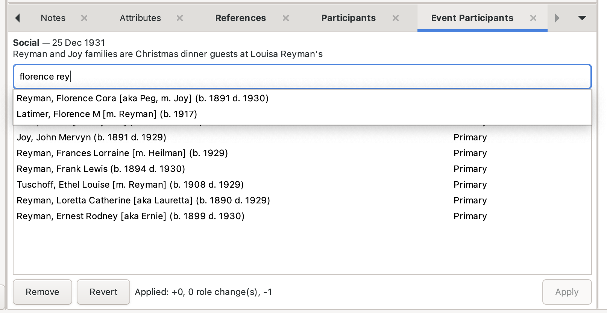

# Event Participants

A [Gramps](https://gramps-project.org) gramplet for attaching one event to many
people at once, from the Events view.

Gramps stores an event reference on the **person**, not on the event. Sharing a
single event — a census, a christening, a Christmas dinner — with everyone who
took part therefore means opening each person's editor and adding the same event
by hand, one at a time. This gramplet does the whole batch in one pass, and
writes it as a single transaction so one Edit → Undo reverses all of it.

It also inserts each new reference **chronologically** into the person's event
list rather than appending it to the end, which is what Gramps does on its own.



Requires **Gramps 6.0**. GPL v2 (see [LICENSE](LICENSE)).

---

## Installing

Copy or symlink `eventparticipants.py` and `eventparticipants.gpr.py` into a
directory of their own under your Gramps user plugins folder:

| Platform | Plugins folder |
|---|---|
| macOS | `~/Library/Application Support/gramps/gramps60/plugins/` |
| Linux | `~/.local/share/gramps/gramps60/plugins/` |
| Windows | `%APPDATA%\gramps\gramps60\plugins\` |

(Gramps derives these from the XDG user-data directory; if you set `GRAMPSHOME`
it is `$GRAMPSHOME/gramps/gramps60/plugins/` instead. Note that `~/.gramps` is a
*legacy* location Gramps only migrates away from — installing there does
nothing.)

```bash
mkdir -p ~/.local/share/gramps/gramps60/plugins/EventParticipants
cp eventparticipants.py eventparticipants.gpr.py \
   ~/.local/share/gramps/gramps60/plugins/EventParticipants/
```

Restart Gramps fully — it does not pick up new plugin code otherwise. Then go to
the **Events** view, right-click the bottombar tab strip, and choose **Event
Participants**.

If the tab doesn't appear, check Plugin Manager → Registered Plugins and
double-click the failed row for a traceback. (Plugin Manager is a separate
dialog from the Addon Manager.)

> **On the name:** the separate `Participants` addon shows an event's
> participants read-only and puts a `Participants` tab in the same bottombar.
> This one is deliberately `Event Participants` so the two tabs stay tellable
> apart. Both can be installed at once.

## Using it

Select an event in the Events view. The gramplet header shows its type, date and
description, and the list fills with everyone already taking part.

### Adding people

Type into the search box. Matching is **word by word, in any order, against
every form of the name** — "john joy" finds `Joy, John Mervyn`, and so does
"joy john". Results are ranked best-first, so the person you meant is at the top
rather than wherever the alphabet put them.

Press **Enter** when what you typed narrows to exactly one person, or click any
row in the drop-down. If several people still match, Enter says how many
(`4 people match 'reyman'`) rather than guessing — except that an exact hit on
one of a person's whole name forms wins outright, so a common surname doesn't
stop you typing a full name and pressing Enter.

Staged additions appear in **bold** marked `new`, and default to the role
**Primary**.

The search covers rather more than the displayed name, and anything that can
cause a match is shown in brackets so a correct hit never looks like a bug:

| Bracket | Means |
|---|---|
| `[Smith]` | an alternate surname she is also recorded under |
| `[aka Peg]` | an alternate given name |
| `[nicknamed Ernie]` | a nickname |
| `[called Ann]` | a call name, when it isn't already one of the given names |
| `[m. Joy]` | a surname reached by marriage, taken from the family record |

That last one matters more than it sounds: a married surname is almost never
stored on the person in practice — it lives in the family record — so without it
"Louisa Reyman" would never find `Heitt, Louisa [m. Reyman]`.

Accents fold, so "Soren" finds "Søren", and apostrophes are indexed both ways,
so "obrien" and "o brien" both find `O'Brien`.

### Who gets offered

People who **cannot have been alive** at the event are left out of the offer.
One date is enough to infer the other to within a 100-year lifespan, so someone
with a birth and no death is still filtered. Christenings stand in for a missing
birth and burials for a missing death, and a two-year grace at each end keeps a
burial or a christening from falling outside its own event. A person with no
dates at all is never excluded, and neither is anyone when the event itself is
undated.

This is deliberately aggressive — it is what makes the shortlist short. When it
gets it wrong, the stock way of attaching a person to an event is still there.
If a search returns nothing but people *were* filtered out, Enter says so
("`No match for 'smith' (3 not living then)`") rather than leaving you to guess.

### Roles

Click any row's **Role** cell to edit it. The drop-down carries the standard
roles plus any custom ones already in your tree, and completes as you type. A
typed role is snapped onto an existing role case- and whitespace-insensitively,
so "primary" gives you **Primary** rather than minting a custom role that merely
looks like it. A genuinely new spelling still creates a custom role — that
remains the supported way to get one.

### Removing people

Select a row and press **Remove**. For someone you just staged this unstages
them; for an existing participant it marks the row `detach`. It toggles —
pressing **Remove** on a row already marked `detach` takes the mark off again.
Nothing is written until you apply.

### Families

Families appear as participants in their own right — a marriage event is
referenced by the Family object, so a person-only list would misrepresent it.
A row reads `Family: John Joy & Louisa Heitt`.

Detaching a family drops **both** spouses at once. That is correct, but blunt.
A listed family also covers both its spouses in the type-ahead, because the
Events view already counts them through the family reference and offering one
again would write a second, personal reference that gets counted twice. If you
want a spouse to have a role of their own at a family event, add it the stock
way through the person editor.

### Applying

**Apply** writes everything in one `DbTxn` and reports what happened:

```
Applied: +3, 1 role change(s), -1
```

**Revert** discards all pending changes and reloads from the database. A single
**Edit → Undo** reverses an entire applied batch.

The gramplet watches the database while you work. If the active event, or a
family taking part in it, is changed somewhere else in Gramps, it reloads — or,
when you have edits staged, tells you so and leaves the reload to Revert rather
than throwing your work away. Switching to a different event with edits staged
reports how many were discarded.

## Notes and limitations

- **Applying commits the event itself**, inside the transaction. This is
  deliberate: it is what makes the Events view's *Main Participants* column
  refresh, and what makes undo and redo replay correctly. The cost is that the
  event's change timestamp moves on every apply.
- **Chronological insertion applies to references added here.** Events added
  through the normal person editor still land at the end of the list.
- **Undated events are appended, not sorted**, so deliberate manual ordering of
  a person's event list is left alone.
- On first use the search box reads `Indexing names... 1500 so far` while the
  name index builds in the background. It is built by streaming the database
  tables rather than by loading objects; on a 2,400-person tree it is a moment.
- Double-clicking a participant does not open the person editor yet.

## Testing

Gramps embeds libpython and ships no interpreter, so the tests stub out Gramps
and GTK and cover the plain logic only — not the GTK wiring:

```bash
python3 test_eventparticipants.py
```

No framework needed.
